# Darkly Ever After

Welcome to **Darkly Ever After**, a Python-based interactive story generator that allows users to create darkly comedic
and existential stories. The project provides two modes: a short story mode and an ongoing story mode, where users can
make choices that influence the direction of the story.

## Setup

To set up the project, follow these steps:

1. **Clone the repository:**
    ```sh
    git clone https://github.com/neurothrone/darkly-ever-after.git
    cd darkly-ever-after
    ```

2. **Create a virtual environment:**
    ```sh
    python3 -m venv venv
    source venv/bin/activate  # On Windows use `venv\Scripts\activate`
    ```

3. **Install the required dependencies:**
    ```sh
    pip install -r requirements.txt
    ```

4. **Run the application:**
    ```sh
    python main.py
    ```

5. **Create a `.env` file with your OpenAI API key:**
    ```
    OPENAI_API_KEY=your-api-key
    ```

## Description

**Darkly Ever After** is an interactive story generator that uses user inputs to create a unique narrative experience.
The project is written in Python and uses the `colorama` library to enhance the terminal output with colors. Users can
choose between two modes:

- **Short Story Mode:** Create a short story with a defined beginning, middle, and end based on user choices.
- **Ongoing Story Mode:** Generate an ongoing story with continuous choices, allowing for an endless adventure.

### Features

- **Interactive Character Setup:** Users can define their character's name, age, and profession.
- **Choice-Based Story Progression:** Users make choices that influence the direction and outcome of the story.
- **Dark Humor and Existential Themes:** The stories generated have a darkly comedic and existential tone.

## Images

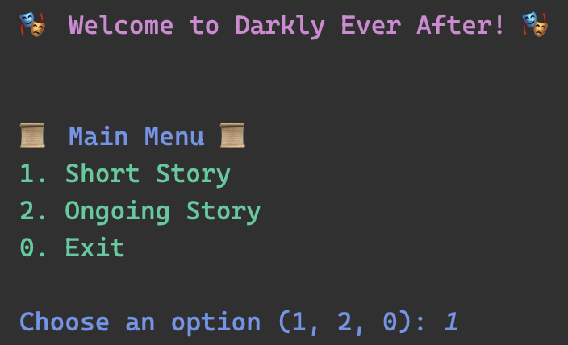
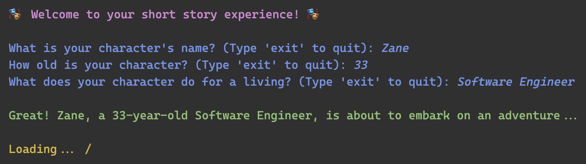
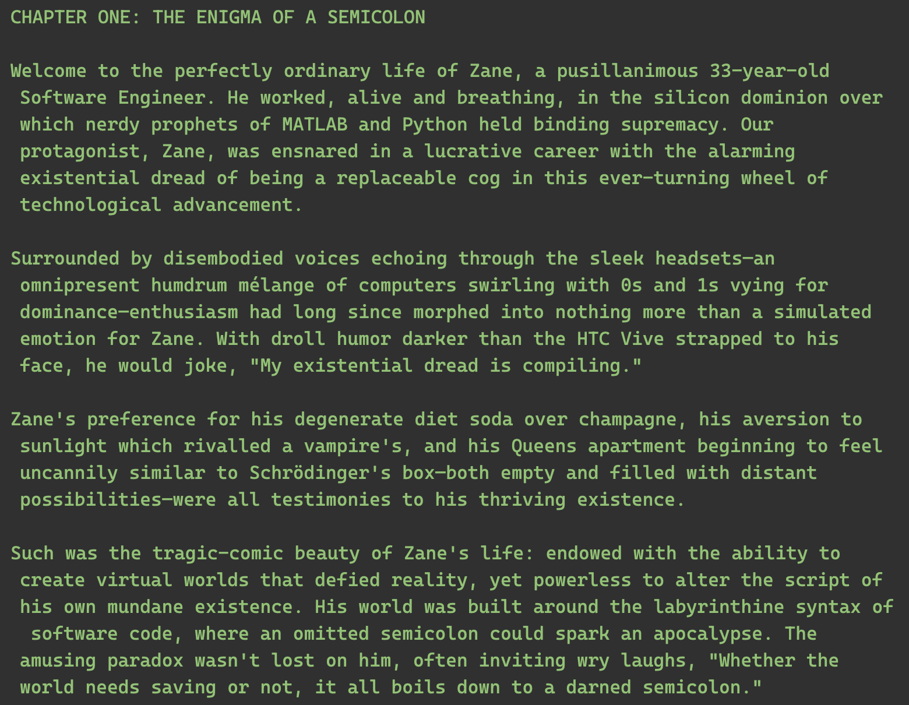
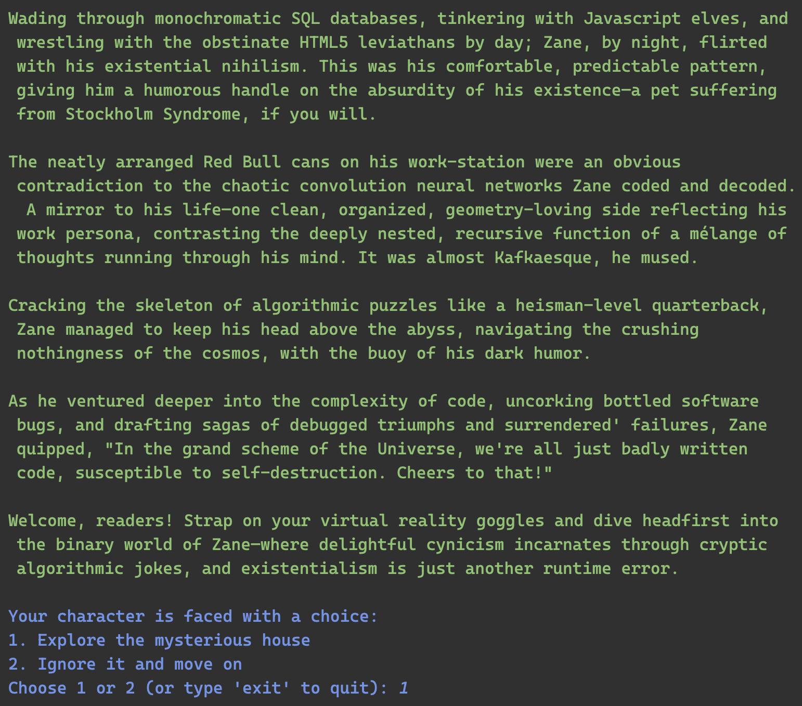
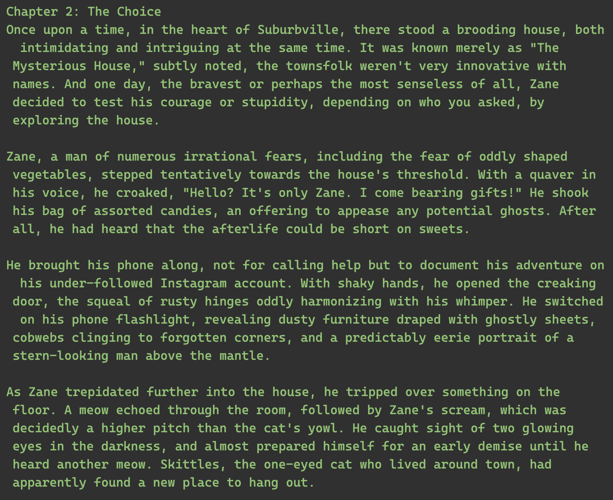
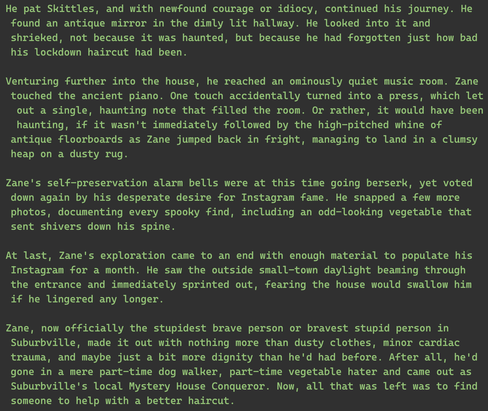
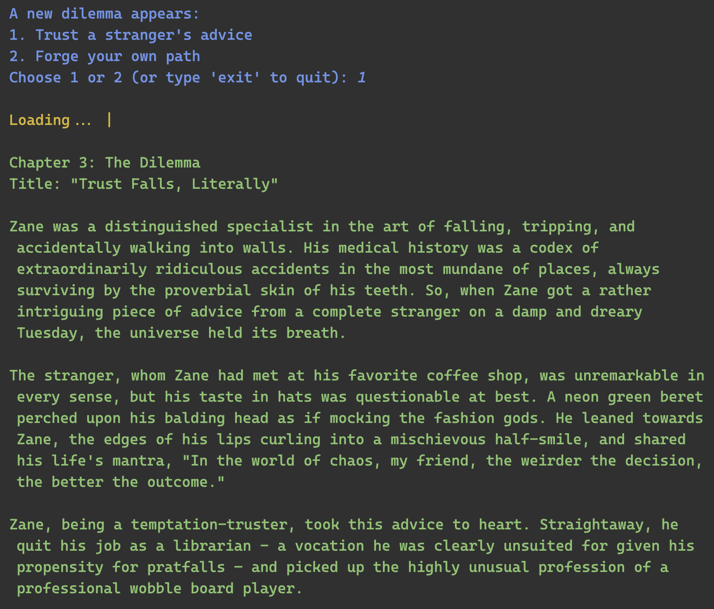
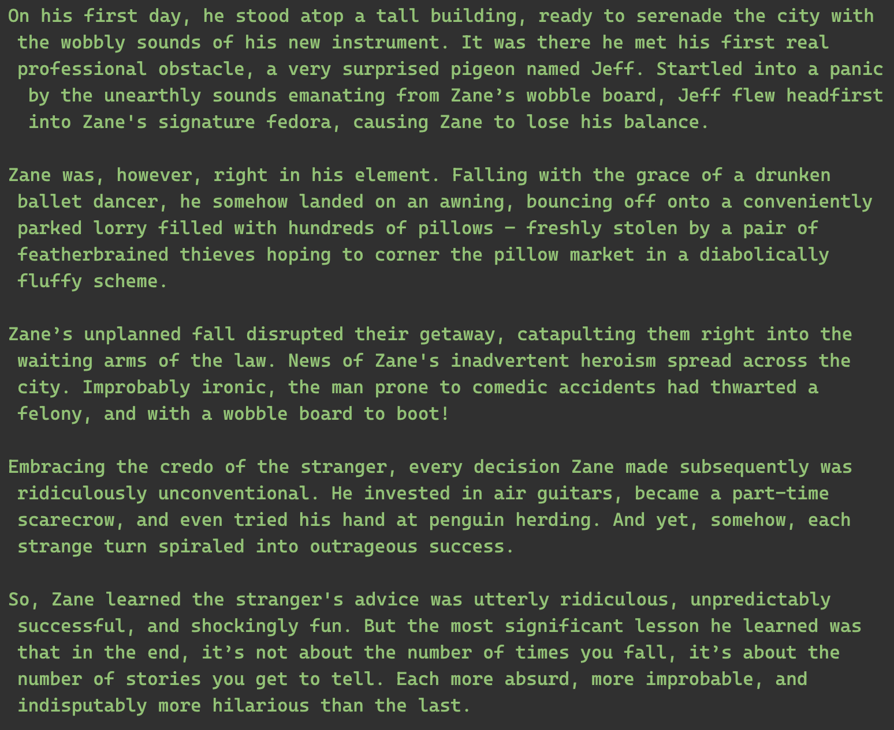
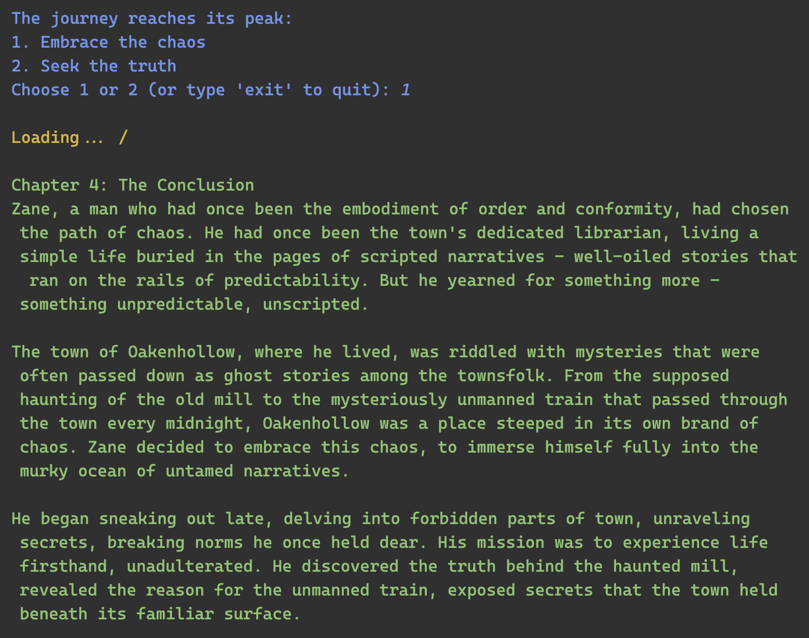
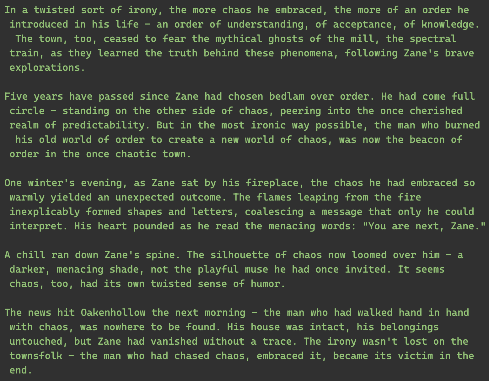
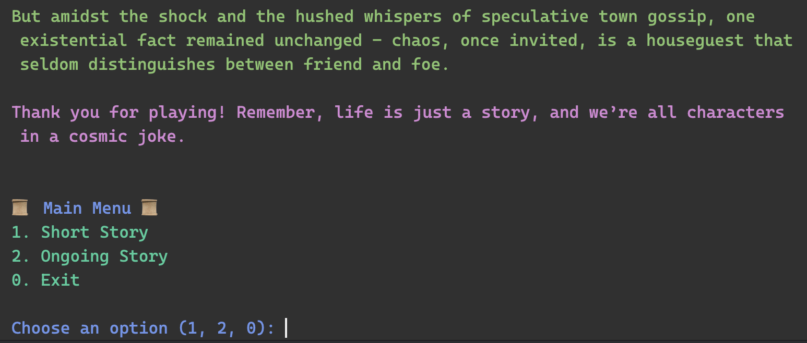